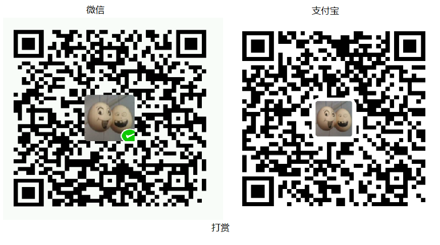

# SDE v4 alpha版

有事儿请邮箱：[dd@sodiao.org](mailto://dd@sodiao.org)在线演示：[http://sde4.tlzzu.com/](http://sde4.tlzzu.com/)

> 最近观察到有人仿照原来SDE v2的结构改了一版，UI布局各种抄袭，然后在世面上拿出去贩卖，在此不作评价，毕竟身在国内已然习惯。本人在此承诺本版本永久免费，欢迎各位使用

讨论群：370844065（有消息会在上面发布）

## 新增功能

1. 打印、续打；
2. 修订模式（留痕）；
3. 支持全键盘操作；
4. 控件对象化，提供更丰富的接口（控件联动）
5. ……功能多到我自己都忘了……

## SDE对象本身的接口文档

1. [SDE初始化时的options文档](./doc/sde.options.md)
2. [SDE实例接口文档](./doc/sde.api.md)

## SDE控件文档：

1. [SDE控件文档](./doc/sde.ctrl.api.md)

## 想到了在补充

## 需求&bug 提交

1.  可邮件至[dd@sodiao.org](mailto://dd@sodiao.org/)；

## 打赏

